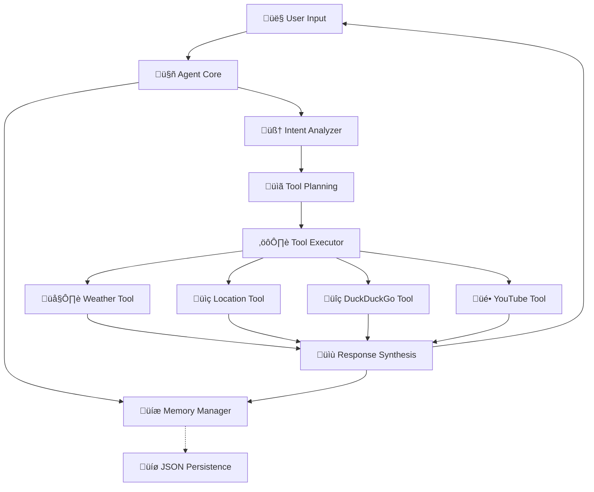

# 🤖 Conversational AI with Tools

[](https://www.python.org/downloads/)
[](https://opensource.org/licenses/MIT)
[](https://www.anthropic.com/)

> A sophisticated conversational AI assistant powered by Anthropic Claude with persistent memory, advanced reasoning capabilities, and seamless multi-tool integration for weather, location services, web search, and YouTube content discovery.

## üåü Features

- **🧠 Advanced Reasoning Engine**: Step-by-step analysis and planning for complex queries
- **üíæ Persistent Memory**: Conversations are saved and recalled across sessions
- **üîß Multi-Tool Integration**: Weather, location search, web search, and YouTube integration
- **‚ö° Async Processing**: Fast, non-blocking operations for better performance
- **🎯 Intelligent Tool Selection**: Automatic tool selection based on user intent
- **üìä Memory Analytics**: Detailed conversation history and statistics

## 🏗️ Architecture Overview



## üìã Prerequisites

- Python 3.8 or higher
- Anthropic API key
- OpenWeather API key (optional, for weather features)
- Internet connection for web-based tools

## üöÄ Quick Start

### 1. Clone the Repository

```bash
git clone https://github.com/yourusername/conversational-ai-with-tools.git
cd conversational-ai-with-tools
```

### 2. Set Up Virtual Environment

```bash
python -m venv agentic-ai-env
source agentic-ai-env/bin/activate  # On Windows: agentic-ai-env\Scripts\activate
```

### 3. Install Dependencies

```bash
pip install -r requirements.txt
```

### 4. Configure Environment Variables

⚠️ **Security Note**: Never commit API keys to version control!

1. Copy the example environment file:
```bash
cp .env.example .env
```

2. Edit `.env` with your actual API keys:
```env
ANTHROPIC_API_KEY=your_actual_anthropic_api_key_here
OPENWEATHER_API_KEY=your_actual_openweather_api_key_here
```

3. The `.env` file is already included in `.gitignore` to prevent accidental commits.

### 5. Run the Application

```bash
python main.py
```

## 🛠️ Installation & Setup

### Detailed Setup Instructions

1. **API Keys Setup**:
   - **Anthropic API**: Get your key from [Anthropic Console](https://console.anthropic.com/)
   - **OpenWeather API**: Get your key from [OpenWeatherMap](https://openweathermap.org/api)

2. **Dependencies**:
   ```bash
   pip install langchain-anthropic
   pip install pydantic
   pip install requests
   pip install geopy
   pip install youtubesearchpython
   pip install duckduckgo-search
   ```

3. **Project Structure**:
   ```
   conversational-ai-with-tools/
   ├── src/
   │   ├── agent/
   │   │   ├── agent_core.py      # Main agent logic
   │   │   └── memory_manager.py  # Memory persistence
   │   ├── tools/
   │   │   ├── weather_tool.py    # Weather integration
   │   │   ├── location_tool.py   # Location services
   │   │   ├── youtube_tool.py    # YouTube search
   │   │   └── duckduckgo_tool.py # Web search
   │   └── config/
   │       └── settings.py        # Configuration
   ├── main.py                    # Application entry point
   ├── memory_check.py           # Memory utility
   └── requirements.txt          # Dependencies
   ```

## 🧠 How It Works

### 1. Reasoning Flow


### 2. Tool Selection Logic

The agent uses intelligent keyword detection and intent analysis:

- **Weather queries**: "weather", "temperature", "forecast" ‚Üí Weather Tool
- **Video requests**: "video", "youtube", "watch" ‚Üí YouTube Tool
- **Location queries**: "location", "address", "coordinates" ‚Üí Location Tool
- **General search**: "search", "find information", "what is" ‚Üí DuckDuckGo Tool

### 3. Memory System


## üí° Usage Examples

### Basic Conversations

#### Weather Inquiry
```
👤 You: What's the weather like in Singapore?

🤖 Assistant: **Weather for Singapore, SG**

🌡️ **Temperature:** 28°C (feels like 32°C)
🌤️ **Condition:** Partly Cloudy - scattered clouds
üíß **Humidity:** 78%
🌬️ **Wind:** 3.2 m/s
üîΩ **Pressure:** 1012 hPa
👁️ **Visibility:** 10000 meters

The weather is quite pleasant today with partly cloudy skies and comfortable temperatures around 28°C.
```

#### Video Search with Reasoning
```
👤 You: Show me videos about Singapore attractions

🤖 Assistant: 🧠 **Detected**: Video content request
üîç **Search Strategy**: Looking for 'Singapore attractions' on YouTube
🎯 **Goal**: Find relevant video content for user's needs
‚úÖ **Found**: YouTube videos matching your request

Here are some great YouTube videos about Singapore attractions:

1. **Singapore Travel Guide - Top 10 Must-Visit Places**
   Channel: Travel with Sam
   Duration: 12:45
   Views: 2.3M views
   URL: https://youtube.com/watch?v=abc123
   Description: Complete guide covering Marina Bay Sands, Gardens by the Bay, and more iconic spots

2. **Singapore in 4K - Amazing Drone Footage**
   Channel: 4K World
   Duration: 8:32
   Views: 856K views
   URL: https://youtube.com/watch?v=def456
   Description: Stunning aerial views of Singapore's skyline and attractions

3. **Singapore Food and Attractions Walking Tour**
   Channel: Food Adventure
   Duration: 15:20
   Views: 1.1M views
   URL: https://youtube.com/watch?v=ghi789
   Description: Experience Singapore's food scene while exploring major attractions
```

#### Complex Weather-Based Planning
```
👤 You: Suggest outdoor places to visit this weekend in Singapore based on weather

🤖 Assistant: 🧠 **Analysis**: Find outdoor places to visit based on weather conditions
🎯 **Reasoning**: Need weather info first, then find activities suitable for those conditions, then get location details

üîß **Using get_weather**: Check current weather conditions
‚úÖ **get_weather completed**: Found relevant information

üîß **Using duckduckgo_search**: Find weather-appropriate activities
‚úÖ **duckduckgo_search completed**: Found relevant information

üîß **Using location_search**: Get details about recommended locations
‚úÖ **location_search completed**: Found relevant information

Based on the current weather conditions in Singapore (28°C, partly cloudy with 78% humidity), here are perfect outdoor places to visit this weekend:

**üå≥ Recommended Outdoor Activities:**

1. **Gardens by the Bay**
   üìç Coordinates: 1.281559, 103.864006
   🌤️ Perfect for: The current mild temperature is ideal for walking through the outdoor gardens
   üí° Tip: Visit the Skyway early morning or late afternoon to avoid the midday heat

2. **East Coast Park**
   üìç Coordinates: 1.301034, 103.928675
   🏖️ Activities: Beach walks, cycling, BBQ spots
   🌤️ Weather Match: Light winds (3.2 m/s) perfect for outdoor sports

3. **Singapore Botanic Gardens**
   üìç Coordinates: 1.307751, 103.815186
   üåø Highlights: UNESCO World Heritage site with shaded walking paths
   üíß Humidity Tip: The 78% humidity is manageable under tree cover

4. **Marina Bay Area**
   üìç Coordinates: 1.286389, 103.858333
   🌃 Perfect timing: Evening visits recommended when temperature drops
   üì∏ Photo ops: Great lighting conditions with partly cloudy skies

**Weekend Weather Forecast Considerations:**
- Bring water and light sun protection
- Scattered clouds provide natural shade
- Light winds make it comfortable for outdoor activities
- Best times: Early morning (7-9 AM) or late afternoon (5-7 PM)
```

#### Multi-turn Conversation with Memory
```
👤 You: What's the distance between Marina Bay Sands and Gardens by the Bay?

🤖 Assistant: **Distance Calculation**
üìç **From:** Marina Bay Sands, 10 Bayfront Avenue, Singapore
üìç **To:** Gardens by the Bay, 18 Marina Gardens Drive, Singapore
üìè **Distance:** 1.2 km (0.75 miles)

These two iconic attractions are very close to each other - just a pleasant 12-15 minute walk!

---

👤 You: How's the weather there right now?

🤖 Assistant: Based on our previous conversation about Singapore attractions, here's the current weather for the Marina Bay area:

**Weather for Singapore, SG**

🌡️ **Temperature:** 28°C (feels like 32°C)
🌤️ **Condition:** Partly Cloudy - scattered clouds
üíß **Humidity:** 78%
🌬️ **Wind:** 3.2 m/s
üîΩ **Pressure:** 1012 hPa

Perfect weather for walking between Marina Bay Sands and Gardens by the Bay! The 1.2km walk will be comfortable with the current conditions and light breeze.

---

👤 You: Show me a video about this walk

🤖 Assistant: I'll find you a video showing the walk between Marina Bay Sands and Gardens by the Bay!

1. **Marina Bay Sands to Gardens by the Bay Walk | Singapore 4K**
   Channel: Singapore Walks
   Duration: 18:45
   Views: 445K views
   URL: https://youtube.com/watch?v=walk123
   Description: Complete walking route with commentary, showing the Helix Bridge and waterfront promenade

2. **Singapore Marina Bay Walking Tour - MBS to GBTB**
   Channel: Travel Singapore
   Duration: 12:30
   Views: 287K views  
   URL: https://youtube.com/watch?v=walk456
   Description: Detailed walk showing all the landmarks and photo spots along the way

This video perfectly matches your question about the walk we just discussed! The weather conditions in the video look similar to today's forecast.
```

### Advanced Features

```python
# Memory check
python memory_check.py

# Export conversations
agent.export_memory("backup.json")

# Search conversation history
agent.get_conversation_by_topic("singapore", limit=5)
```

### Real-time Interaction Examples

#### Location Search
```
👤 You: Find information about Sentosa Island

🤖 Assistant: **1. Sentosa Island, Singapore**
üìç **Coordinates:** 1.256041, 103.818671
🏢 **Type:** Island resort destination
üåç **Country:** Singapore
🏙️ **City:** Singapore
📮 **Postal Code:** Various (Sentosa postal codes)

**About Sentosa Island:**
Sentosa Island is Singapore's premier island resort getaway, connected to mainland Singapore by causeway, cable car, and monorail. Known for its beaches, theme parks, luxury resorts, and entertainment attractions, it's a popular destination for both tourists and locals seeking recreation and relaxation.

**Key Features:**
- Universal Studios Singapore
- S.E.A. Aquarium
- Multiple beaches (Siloso, Palawan, Tanjong)
- Adventure Cove Waterpark
- Resorts World Sentosa
```

#### Search Integration
```
👤 You: What are the latest developments in Singapore's smart city initiatives?

🤖 Assistant: Here's what I found about Singapore's latest smart city developments:

1. **Singapore Launches Digital Economy Framework 2025**
   URL: https://example.com/digital-economy-2025
   Summary: Singapore unveils comprehensive strategy to become a leading digital economy hub, focusing on AI integration, digital infrastructure, and workforce transformation.

2. **Smart Nation 2.0: Next Phase of Urban Innovation**
   URL: https://example.com/smart-nation-2-0
   Summary: New initiatives include IoT sensor networks, predictive urban planning, and enhanced digital government services for citizens.

3. **Singapore's AI Governance Model Gains International Recognition**
   URL: https://example.com/ai-governance-model
   Summary: Singapore's approach to ethical AI development and regulation is being adopted by other smart cities worldwide.

4. **Green Smart City: Sustainable Technology Integration**
   URL: https://example.com/green-smart-city
   Summary: Latest projects focus on combining environmental sustainability with smart city technology, including smart grids and IoT-enabled waste management.

These developments show Singapore's continued leadership in smart city innovation, particularly in AI governance and sustainable technology integration.
```

## üîß Configuration

### Environment Variables

| Variable | Description | Required |
|----------|-------------|----------|
| `ANTHROPIC_API_KEY` | Anthropic Claude API key | Yes |
| `OPENWEATHER_API_KEY` | OpenWeather API key | No |

### Agent Settings

Modify `src/config/settings.py` to customize:

```python
class Settings:
    anthropic_api_key: str
    openweather_api_key: str = None
    max_memory_turns: int = 100
    tool_timeout: int = 30
```

## üìä Memory Management

### Conversation Persistence

The agent automatically saves all conversations to `conversation_memory.json`:

```json
{
  "conversation_history": [
    {
      "user_message": "What's the weather?",
      "agent_response": "Current weather info...",
      "timestamp": "2024-01-10T15:30:00",
      "tool_calls": [...],
      "metadata": {...}
    }
  ],
  "session_memory": {},
  "last_updated": "2024-01-10T15:30:00"
}
```

### Memory Utilities

```bash
# Check memory status
python memory_check.py

# View memory statistics
python -c "from src.agent.memory_manager import MemoryManager; print(MemoryManager().get_memory_stats())"
```

## üîç Available Tools

### 1. Weather Tool
- **Purpose**: Get current weather conditions
- **Usage**: Triggered by weather-related keywords
- **API**: OpenWeatherMap
- **Example**: "What's the weather in Tokyo?"

### 2. Location Tool
- **Purpose**: Search for location information and coordinates
- **Usage**: Address and location queries
- **API**: Nominatim (OpenStreetMap)
- **Example**: "Find the coordinates of Eiffel Tower"

### 3. YouTube Tool
- **Purpose**: Search for YouTube videos
- **Usage**: Video content requests
- **API**: YouTube Search Python
- **Example**: "Show me cooking videos"

### 4. DuckDuckGo Tool
- **Purpose**: Web search for current information
- **Usage**: General information queries
- **API**: DuckDuckGo Search API
- **Example**: "Search for latest tech news"

## üöÄ Advanced Usage

### Custom Tool Integration

Add new tools by extending the `BaseTool` class:

```python
class CustomTool(BaseTool):
    name: str = "custom_tool"
    description: str = "Custom tool description"
    args_schema: Type[BaseModel] = CustomInput
    
    def _run(self, **kwargs) -> str:
        # Tool implementation
        return "Tool result"
```

### Memory Customization

Extend the memory manager for custom storage:

```python
class DatabaseMemoryManager(MemoryManager):
    def save_to_database(self):
        # Custom database implementation
        pass
```

## üîß Troubleshooting

### Common Issues

1. **API Key Errors**:
   ```bash
   ValueError: ANTHROPIC_API_KEY not found
   ```
   **Solution**: Ensure your `.env` file contains valid API keys

2. **Tool Execution Errors**:
   ```bash
   Error executing tool_name: Connection timeout
   ```
   **Solution**: Check internet connection and API rate limits

3. **Memory Loading Issues**:
   ```bash
   Error loading memory from file
   ```
   **Solution**: Delete `conversation_memory.json` to reset memory

### Debug Mode

Enable detailed logging:

```python
import logging
logging.basicConfig(level=logging.INFO)
```

## üìà Performance Optimization

### Tips for Better Performance

1. **Limit Memory Size**: Configure `max_memory_turns` in settings
2. **Tool Timeouts**: Set appropriate timeouts for external APIs
3. **Async Operations**: Use async/await for I/O operations
4. **Memory Cleanup**: Periodically clean old conversations

## üîí Security Best Practices

1. **Never commit sensitive information**:
   - API keys are stored in `.env` (ignored by git)
   - Use environment variables for production deployment
   - Regularly rotate API keys

2. **Conversation Privacy**:
   - `conversation_memory.json` contains chat history
   - Consider adding it to `.gitignore` for privacy
   - Use encryption for sensitive conversations

## 🤝 Contributing

We welcome contributions! Please follow these steps:

1. Fork the repository
2. Create a feature branch: `git checkout -b feature/new-feature`
3. Commit changes: `git commit -am 'Add new feature'`
4. Push to branch: `git push origin feature/new-feature`
5. Submit a Pull Request

### Development Setup

```bash
# Install development dependencies
pip install -r requirements-dev.txt

# Run tests
python -m pytest tests/

# Code formatting
black src/
```

## 📄 License

This project is licensed under the MIT License - see the [LICENSE](LICENSE) file for details.

## üôè Acknowledgments

- [Anthropic](https://www.anthropic.com/) for Claude AI
- [LangChain](https://langchain.com/) for the agent framework
- [OpenWeatherMap](https://openweathermap.org/) for weather data
- [Nominatim](https://nominatim.org/) for location services

## üìû Support

For support and questions:

- Create an issue on GitHub: [conversational-ai-with-tools/issues](https://github.com/yourusername/conversational-ai-with-tools/issues)
- Check the [FAQ](docs/FAQ.md)
- Review [examples](examples/) for usage patterns

---

**Made with ❤️ for the conversational AI community**