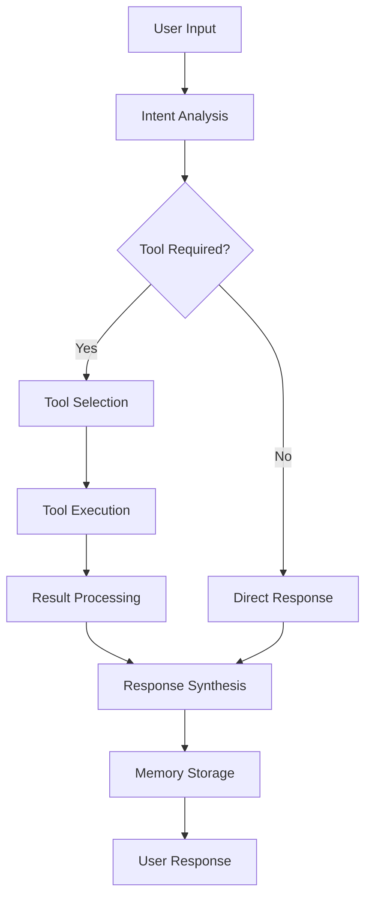

# 🏗️ Architecture Documentation - Conversational AI with Tools

## System Overview

The Conversational AI with Tools follows a modular, event-driven architecture designed for scalability and maintainability, providing seamless integration between conversational AI and external tool capabilities.

## Core Components

### 1. Agent Core (`agent_core.py`)
- **Responsibility**: Central orchestration and reasoning for conversational AI interactions
- **Key Features**:
  - Intent analysis and planning
  - Tool execution coordination
  - Response synthesis
  - Memory integration

### 2. Memory Manager (`memory_manager.py`)
- **Responsibility**: Conversation persistence and retrieval for continuous dialogue
- **Storage**: JSON-based file system
- **Features**:
  - Automatic conversation saving
  - Context search and retrieval
  - Session data management

### 3. Tool System
- **Modular Design**: Each tool is independent and can be easily extended
- **Common Interface**: All tools extend `BaseTool` for consistency
- **Async Support**: Non-blocking operations for better conversational flow

## Data Flow



## Tool Architecture

### Tool Interface
```python
class BaseTool:
    name: str
    description: str
    args_schema: Type[BaseModel]
    
    def _run(self, **kwargs) -> str:
        # Synchronous execution
    
    async def _arun(self, **kwargs) -> str:
        # Asynchronous execution
```

### Tool Registration
Tools are automatically registered during agent initialization:

```python
self.tools = [
    WeatherTool(),
    LocationTool(),
    DistanceCalculatorTool(),
    DuckDuckGoTool(),
    YouTubeTool()
]
```

## Memory Architecture

### Conversation Turn Structure
```python
class ConversationTurn(BaseModel):
    timestamp: datetime
    user_message: str
    agent_response: str
    tool_calls: List[Dict[str, Any]] = []
    metadata: Dict[str, Any] = {}
```

### Persistence Strategy
- **Format**: JSON
- **Location**: Project root (`conversation_memory.json`)
- **Backup**: Automatic on every conversation
- **Loading**: On agent initialization

## Reasoning Engine

### Intent Analysis Pipeline
1. **Input Processing**: Clean and enhance user message
2. **Context Integration**: Add relevant conversation history
3. **Intent Classification**: Determine user's goal
4. **Tool Planning**: Select appropriate tools and sequence
5. **Execution Strategy**: Plan tool execution order

### Response Synthesis
1. **Data Aggregation**: Collect all tool results
2. **Context Assembly**: Combine with conversation history
3. **Response Generation**: Create coherent, helpful response
4. **Quality Check**: Ensure response completeness

## Error Handling

### Graceful Degradation
- Tool failures don't crash the system
- Fallback responses for API issues
- Memory persistence errors are logged but don't block operation

### Error Recovery
```python
try:
    result = await self.execute_tool(tool_name, params)
except Exception as e:
    result = f"Error executing {tool_name}: {str(e)}"
```

## Security Considerations

### API Key Management
- Environment variable storage
- No hardcoded credentials
- Key validation on startup

### Input Validation
- Pydantic schemas for all tool inputs
- SQL injection prevention (though not using SQL)
- Rate limiting considerations for external APIs

## Performance Optimizations

### Async Operations
- Non-blocking tool execution
- Concurrent API calls when possible
- Efficient memory operations

### Caching Strategy
- Session-level caching for repeated queries
- Tool result caching (future enhancement)
- Memory indexing for fast retrieval

## Scalability Design

### Horizontal Scaling
- Stateless agent design
- External memory storage capability
- Tool isolation allows independent scaling

### Vertical Scaling
- Memory management controls
- Configurable tool timeouts
- Resource usage monitoring

## Extension Points

### Adding New Tools to Conversational AI
1. Create tool class extending `BaseTool`
2. Define input schema with Pydantic
3. Implement `_run` and `_arun` methods
4. Register in agent initialization

### Custom Memory Backends for Conversation History
1. Extend `MemoryManager` class
2. Implement custom storage methods
3. Maintain interface compatibility

### Enhanced Reasoning for Better Conversations
1. Custom intent analyzers
2. Advanced planning algorithms
3. Multi-step reasoning chains
