# 🏗️ Architecture Documentation - Conversational AI with Tools

## System Overview

The Conversational AI with Tools implements a sophisticated, MCP-inspired architecture that provides a clear separation between agent logic, tool management, and external service integration. While not implementing the full MCP protocol, it follows similar patterns for modularity and extensibility.

## Complete System Architecture

### 1. User Input to LLM Response Flow

```mermaid
graph TD
    A[👤 User Input] --> B[📝 Input Processing]
    B --> C[🧠 Context Enhancement]
    C --> D[💾 Memory Retrieval]
    D --> E[🎯 Intent Analysis]
    E --> F[🧠 Reasoning Engine]
    F --> G[📋 Tool Planning]
    G --> H[⚙️ Tool Execution]
    H --> I[📊 Result Aggregation]
    I --> J[🔄 Response Synthesis]
    J --> K[🤖 Claude API Call]
    K --> L[📝 Response Formatting]
    L --> M[💾 Memory Persistence]
    L --> N[📤 User Response]
```



## Layered Architecture

### 1. Presentation Layer
- **User Interface**: Command-line interface for user interaction
- **Input Validation**: Sanitizes and validates user inputs
- **Response Formatting**: Structures outputs for optimal user experience

### 2. Agent Logic Layer
- **Agent Core**: Central orchestration and decision-making
- **Memory Manager**: Conversation persistence and context management
- **Reasoning Engine**: Multi-step analysis and planning

### 3. Service Management Layer (MCP-Like)
- **Tool Manager**: Coordinates tool selection and execution
- **Service Registry**: Maintains available tools and their capabilities
- **Message Router**: Routes requests to appropriate services

### 4. Tool Execution Layer
- **Tool Abstraction**: Common interface for all tools
- **Async Execution**: Non-blocking tool operations
- **Error Handling**: Graceful degradation on tool failures

### 5. External Service Layer
- **API Integrations**: Weather, Location, Search, YouTube services
- **Rate Limiting**: Manages API call frequency
- **Caching**: Optimizes repeated requests

## MCP-Inspired Design Patterns

### Service Discovery and Registration
```python
class ToolManager:
    def __init__(self):
        self.services = {}
        self.register_services()
    
    def register_services(self):
        """Register available tools/services"""
        self.services = {
            "weather": WeatherTool(),
            "location": LocationTool(),
            "search": DuckDuckGoTool(),
            "youtube": YouTubeTool()
        }
    
    def discover_service(self, intent: str) -> str:
        """Discover appropriate service for user intent"""
        # Intent-based service discovery logic
        pass
```

### Message Protocol (MCP-Like)
```python
class ServiceMessage:
    def __init__(self, service: str, method: str, params: dict):
        self.service = service
        self.method = method
        self.params = params
        self.id = uuid.uuid4()
    
    def to_dict(self) -> dict:
        return {
            "jsonrpc": "2.0",
            "method": f"{self.service}.{self.method}",
            "params": self.params,
            "id": str(self.id)
        }
```

### Resource Management
```python
class ResourceManager:
    def __init__(self):
        self.resources = {
            "weather": "Real-time weather data",
            "locations": "Global location database",
            "web": "Internet search capability",
            "videos": "YouTube content access"
        }
    
    def list_resources(self) -> List[dict]:
        """List available resources (MCP-like)"""
        return [
            {
                "uri": f"resource://{name}",
                "name": name,
                "description": desc
            }
            for name, desc in self.resources.items()
        ]
```

## Detailed Component Architecture

### Agent Core Processing Pipeline


### Memory Architecture (Persistent Context)


### Tool Execution Framework


## Request Lifecycle

### 1. Input Processing Phase
1. **User Input Reception**: Capture raw user message
2. **Input Sanitization**: Clean and validate input
3. **Context Enhancement**: Add conversation history
4. **Memory Search**: Find relevant past interactions

### 2. Analysis Phase
1. **Intent Recognition**: Determine user's goal
2. **Complexity Assessment**: Evaluate query complexity
3. **Tool Requirement Analysis**: Identify needed tools
4. **Execution Strategy Planning**: Plan optimal approach

### 3. Execution Phase
1. **Tool Selection**: Choose appropriate tools
2. **Parallel Execution**: Run tools concurrently
3. **Result Collection**: Gather all tool outputs
4. **Error Handling**: Manage failures gracefully

### 4. Synthesis Phase
1. **Data Aggregation**: Combine tool results
2. **Context Assembly**: Merge with conversation history
3. **LLM Generation**: Generate coherent response
4. **Response Formatting**: Structure for user consumption

### 5. Persistence Phase
1. **Memory Storage**: Save conversation turn
2. **Metadata Recording**: Store execution details
3. **Index Updates**: Update search indices
4. **Cache Management**: Update result caches

## MCP Alignment and Future Migration

### Current MCP-Like Features
- ✅ **Service Discovery**: Tool registration and discovery
- ✅ **Resource Management**: Tool capability exposition
- ✅ **Async Communication**: Non-blocking operations
- ✅ **Error Handling**: Graceful service degradation
- ✅ **Extensibility**: Easy tool addition

### Path to Full MCP Implementation
1. **Protocol Standardization**: Implement JSON-RPC protocol
2. **Process Isolation**: Separate tool processes
3. **Standard Interfaces**: Adopt MCP tool definitions
4. **Client-Server Model**: Split agent and tools
5. **Discovery Protocol**: Implement MCP discovery

### Migration Strategy
```python
# Current Tool Interface
class WeatherTool(BaseTool):
    def _run(self, location: str) -> str:
        # Direct implementation
        pass

# Future MCP Tool Interface
class MCPWeatherTool(MCPTool):
    def __init__(self):
        super().__init__(
            name="weather",
            server_command=["python", "weather_server.py"]
        )
    
    async def call(self, method: str, params: dict) -> dict:
        # MCP protocol communication
        pass
```

## Performance Optimizations

### Async Processing
- **Non-blocking I/O**: All external API calls are async
- **Concurrent Execution**: Multiple tools run in parallel
- **Resource Pooling**: Efficient connection management

### Memory Management
- **Lazy Loading**: Load conversation history on demand
- **Compression**: Compress old conversation data
- **Indexing**: Fast search through conversation history

### Caching Strategy
- **Response Caching**: Cache tool results temporarily
- **Context Caching**: Cache frequently accessed context
- **API Rate Limiting**: Respect external API limits

## Security Architecture

### Input Validation
- **Schema Validation**: Pydantic models for all inputs
- **Sanitization**: Clean user inputs
- **Rate Limiting**: Prevent abuse

### API Security
- **Environment Variables**: Secure API key storage
- **Request Signing**: Secure API communications
- **Error Masking**: Don't expose sensitive error details

### Data Protection
- **Memory Encryption**: Option for encrypted storage
- **PII Detection**: Identify and protect personal data
- **Audit Logging**: Track all system interactions

This architecture provides a solid foundation for building sophisticated conversational AI systems while maintaining the flexibility to migrate to full MCP compliance in the future.
